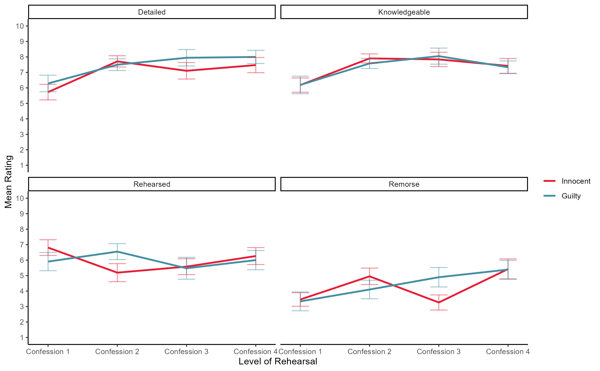

Rehearsal of Confessions
================
2022-12-22

# Study 1: True and False Confessions

## Word Count

### Model Comparison

``` r
lrt_1_2
```

    ## Data: study_1_long
    ## Models:
    ## model_1: length ~ Condition + confession_number + (1 | ID)
    ## model_2: length ~ Condition + confession_number + confession_number_sq + (1 | ID)
    ##         npar    AIC    BIC  logLik deviance  Chisq Df Pr(>Chisq)    
    ## model_1    5 1530.2 1545.2 -760.10   1520.2                         
    ## model_2    6 1501.5 1519.5 -744.77   1489.5 30.659  1  3.077e-08 ***
    ## ---
    ## Signif. codes:  0 '***' 0.001 '**' 0.01 '*' 0.05 '.' 0.1 ' ' 1

``` r
lrt_2_3
```

    ## Data: study_1_long
    ## Models:
    ## model_2: length ~ Condition + confession_number + confession_number_sq + (1 | ID)
    ## model_3: length ~ Condition * confession_number + Condition * confession_number_sq + (1 | ID)
    ##         npar    AIC    BIC  logLik deviance Chisq Df Pr(>Chisq)   
    ## model_2    6 1501.5 1519.5 -744.77   1489.5                       
    ## model_3    8 1495.6 1519.5 -739.78   1479.6  9.98  2   0.006806 **
    ## ---
    ## Signif. codes:  0 '***' 0.001 '**' 0.01 '*' 0.05 '.' 0.1 ' ' 1

### Regression Tables

``` r
summary(model_1)
```

    ## Linear mixed model fit by maximum likelihood . t-tests use Satterthwaite's
    ##   method [lmerModLmerTest]
    ## Formula: length ~ Condition + confession_number + (1 | ID)
    ##    Data: study_1_long
    ## 
    ##      AIC      BIC   logLik deviance df.resid 
    ##   1530.2   1545.2   -760.1   1520.2      143 
    ## 
    ## Scaled residuals: 
    ##      Min       1Q   Median       3Q      Max 
    ## -2.47765 -0.52549  0.02123  0.44757  2.11014 
    ## 
    ## Random effects:
    ##  Groups   Name        Variance Std.Dev.
    ##  ID       (Intercept) 1769     42.06   
    ##  Residual             1005     31.70   
    ## Number of obs: 148, groups:  ID, 37
    ## 
    ## Fixed effects:
    ##                   Estimate Std. Error      df t value Pr(>|t|)    
    ## (Intercept)         64.169     10.641  46.270   6.031 2.55e-07 ***
    ## Condition           55.296     14.827  37.000   3.730 0.000641 ***
    ## confession_number   17.562      2.331 111.000   7.535 1.41e-11 ***
    ## ---
    ## Signif. codes:  0 '***' 0.001 '**' 0.01 '*' 0.05 '.' 0.1 ' ' 1
    ## 
    ## Correlation of Fixed Effects:
    ##             (Intr) Condtn
    ## Condition   -0.640       
    ## cnfssn_nmbr -0.329  0.000

``` r
summary(model_2)
```

    ## Linear mixed model fit by maximum likelihood . t-tests use Satterthwaite's
    ##   method [lmerModLmerTest]
    ## Formula: length ~ Condition + confession_number + confession_number_sq +  
    ##     (1 | ID)
    ##    Data: study_1_long
    ## 
    ##      AIC      BIC   logLik deviance df.resid 
    ##   1501.5   1519.5   -744.8   1489.5      142 
    ## 
    ## Scaled residuals: 
    ##      Min       1Q   Median       3Q      Max 
    ## -2.46421 -0.54860 -0.08472  0.54593  2.54113 
    ## 
    ## Random effects:
    ##  Groups   Name        Variance Std.Dev.
    ##  ID       (Intercept) 1829.5   42.77   
    ##  Residual              762.3   27.61   
    ## Number of obs: 148, groups:  ID, 37
    ## 
    ## Fixed effects:
    ##                      Estimate Std. Error      df t value Pr(>|t|)    
    ## (Intercept)            50.683     10.744  47.995   4.717 2.10e-05 ***
    ## Condition              55.296     14.827  37.000   3.730 0.000641 ***
    ## confession_number      58.022      7.105 111.000   8.166 5.55e-13 ***
    ## confession_number_sq  -13.486      2.270 111.000  -5.942 3.30e-08 ***
    ## ---
    ## Signif. codes:  0 '***' 0.001 '**' 0.01 '*' 0.05 '.' 0.1 ' ' 1
    ## 
    ## Correlation of Fixed Effects:
    ##             (Intr) Condtn cnfss_
    ## Condition   -0.634              
    ## cnfssn_nmbr -0.283  0.000       
    ## cnfssn_nmb_  0.211  0.000 -0.958

``` r
summary(model_3)
```

    ## Linear mixed model fit by maximum likelihood . t-tests use Satterthwaite's
    ##   method [lmerModLmerTest]
    ## Formula: 
    ## length ~ Condition * confession_number + Condition * confession_number_sq +  
    ##     (1 | ID)
    ##    Data: study_1_long
    ## 
    ##      AIC      BIC   logLik deviance df.resid 
    ##   1495.6   1519.5   -739.8   1479.6      140 
    ## 
    ## Scaled residuals: 
    ##      Min       1Q   Median       3Q      Max 
    ## -2.14658 -0.52737 -0.04702  0.46583  2.36392 
    ## 
    ## Random effects:
    ##  Groups   Name        Variance Std.Dev.
    ##  ID       (Intercept) 1845.8   42.96   
    ##  Residual              696.8   26.40   
    ## Number of obs: 148, groups:  ID, 37
    ## 
    ## Fixed effects:
    ##                                Estimate Std. Error      df t value Pr(>|t|)    
    ## (Intercept)                      61.038     11.198  55.938   5.451 1.17e-06 ***
    ## Condition                        32.760     16.520  55.938   1.983 0.052281 .  
    ## confession_number                45.988      9.239 111.000   4.978 2.37e-06 ***
    ## confession_number_sq            -11.288      2.951 111.000  -3.825 0.000217 ***
    ## Condition:confession_number      26.192     13.630 111.000   1.922 0.057215 .  
    ## Condition:confession_number_sq   -4.786      4.354 111.000  -1.099 0.274042    
    ## ---
    ## Signif. codes:  0 '***' 0.001 '**' 0.01 '*' 0.05 '.' 0.1 ' ' 1
    ## 
    ## Correlation of Fixed Effects:
    ##             (Intr) Condtn cnfss_ cnfs__ Cndt:_
    ## Condition   -0.678                            
    ## cnfssn_nmbr -0.354  0.240                     
    ## cnfssn_nmb_  0.264 -0.179 -0.958              
    ## Cndtn:cnfs_  0.240 -0.354 -0.678  0.650       
    ## Cndtn:cnf__ -0.179  0.264  0.650 -0.678 -0.958

# Study 2: Observers

## Model Comparisons

### Guilt

``` r
lrt_guilt
```

    ## Data: study_2
    ## Models:
    ## model_guilt_1: guilt ~ culpability + confession_number + (1 | video)
    ## model_guilt_2: guilt ~ culpability + confession_number + confession_number_sq + (1 | video)
    ## model_guilt_3: guilt ~ culpability * confession_number + culpability * confession_number_sq + (1 | video)
    ##               npar    AIC    BIC  logLik deviance   Chisq Df Pr(>Chisq)    
    ## model_guilt_1    4 727.76 745.58 -359.88   719.76                          
    ## model_guilt_2    5 713.35 735.63 -351.68   703.35 16.4033  1   5.12e-05 ***
    ## model_guilt_3    7 715.60 746.78 -350.80   701.60  1.7571  2     0.4154    
    ## ---
    ## Signif. codes:  0 '***' 0.001 '**' 0.01 '*' 0.05 '.' 0.1 ' ' 1

### Confidence

``` r
lrt_confidence
```

    ## Data: study_2
    ## Models:
    ## model_confidence_1: Confidence ~ guilt + culpability + confession_number + (1 | video)
    ## model_confidence_2: Confidence ~ guilt + culpability + confession_number + confession_number_sq + (1 | video)
    ## model_confidence_3: Confidence ~ guilt * confession_number + guilt * confession_number_sq + culpability + (1 | video)
    ##                    npar    AIC    BIC  logLik deviance  Chisq Df Pr(>Chisq)   
    ## model_confidence_1    6 2571.7 2598.5 -1279.9   2559.7                        
    ## model_confidence_2    7 2565.2 2596.3 -1275.6   2551.2 8.5824  1   0.003394 **
    ## model_confidence_3    9 2563.3 2603.4 -1272.7   2545.3 5.8201  2   0.054472 . 
    ## ---
    ## Signif. codes:  0 '***' 0.001 '**' 0.01 '*' 0.05 '.' 0.1 ' ' 1

### Knowledgeable

``` r
lrt_know
```

    ## Data: study_2
    ## Models:
    ## model_know_1: Knowledgeable ~ culpability + confession_number + (1 | video)
    ## model_know_2: Knowledgeable ~ culpability + confession_number + confession_number_sq + (1 | video)
    ## model_know_3: Knowledgeable ~ culpability * confession_number + culpability * confession_number_sq + (1 | video)
    ##              npar    AIC    BIC  logLik deviance   Chisq Df Pr(>Chisq)    
    ## model_know_1    5 2643.3 2665.6 -1316.7   2633.3                          
    ## model_know_2    6 2611.9 2638.6 -1299.9   2599.9 33.4500  1  7.312e-09 ***
    ## model_know_3    8 2614.2 2649.8 -1299.1   2598.2  1.6926  2      0.429    
    ## ---
    ## Signif. codes:  0 '***' 0.001 '**' 0.01 '*' 0.05 '.' 0.1 ' ' 1

### Remorse

``` r
lrt_remorse_1_2
```

    ## Data: study_2
    ## Models:
    ## model_remorse_1: Remorse ~ culpability + confession_number + (1 | video)
    ## model_remorse_2: Remorse ~ culpability + confession_number + confession_number_sq + (1 | video)
    ##                 npar    AIC    BIC  logLik deviance  Chisq Df Pr(>Chisq)
    ## model_remorse_1    5 2912.9 2935.2 -1451.5   2902.9                     
    ## model_remorse_2    6 2914.8 2941.5 -1451.4   2902.8 0.1806  1     0.6709

``` r
lrt_remorse_1_3
```

    ## Data: study_2
    ## Models:
    ## model_remorse_1: Remorse ~ culpability + confession_number + (1 | video)
    ## model_remorse_3: Remorse ~ culpability * confession_number + (1 | video)
    ##                 npar    AIC    BIC  logLik deviance Chisq Df Pr(>Chisq)
    ## model_remorse_1    5 2912.9 2935.2 -1451.5   2902.9                    
    ## model_remorse_3    6 2914.3 2941.0 -1451.1   2902.3 0.665  1     0.4148

### Detailed

``` r
lrt_detail
```

    ## Data: study_2
    ## Models:
    ## model_detail_1: Detailed ~ culpability + confession_number + (1 | video)
    ## model_detail_2: Detailed ~ culpability + confession_number + confession_number_sq + (1 | video)
    ## model_detail_3: Detailed ~ culpability * confession_number + culpability * confession_number_sq + (1 | video)
    ##                npar    AIC    BIC  logLik deviance   Chisq Df Pr(>Chisq)    
    ## model_detail_1    5 2756.1 2778.4 -1373.1   2746.1                          
    ## model_detail_2    6 2747.3 2774.0 -1367.6   2735.3 10.8438  1  0.0009913 ***
    ## model_detail_3    8 2749.7 2785.3 -1366.8   2733.7  1.6179  2  0.4453302    
    ## ---
    ## Signif. codes:  0 '***' 0.001 '**' 0.01 '*' 0.05 '.' 0.1 ' ' 1

### Rehearsal

``` r
lrt_rehearse_1_2
```

    ## Data: study_2
    ## Models:
    ## model_rehearse_1: Rehearsed ~ culpability + confession_number + (1 | video)
    ## model_rehearse_2: Rehearsed ~ culpability + confession_number + confession_number_sq + (1 | video)
    ##                  npar    AIC    BIC  logLik deviance  Chisq Df Pr(>Chisq)
    ## model_rehearse_1    5 2919.2 2941.5 -1454.6   2909.2                     
    ## model_rehearse_2    6 2919.5 2946.2 -1453.8   2907.5 1.6992  1     0.1924

``` r
lrt_rehearse_1_3
```

    ## Data: study_2
    ## Models:
    ## model_rehearse_1: Rehearsed ~ culpability + confession_number + (1 | video)
    ## model_rehearse_3: Rehearsed ~ culpability * confession_number + (1 | video)
    ##                  npar    AIC    BIC  logLik deviance  Chisq Df Pr(>Chisq)  
    ## model_rehearse_1    5 2919.2 2941.5 -1454.6   2909.2                       
    ## model_rehearse_3    6 2916.5 2943.2 -1452.3   2904.5 4.7253  1    0.02972 *
    ## ---
    ## Signif. codes:  0 '***' 0.001 '**' 0.01 '*' 0.05 '.' 0.1 ' ' 1

## Regression Tables

### Guilt

``` r
summary(model_guilt_1)
```

    ## Generalized linear mixed model fit by maximum likelihood (Laplace
    ##   Approximation) [glmerMod]
    ##  Family: binomial  ( logit )
    ## Formula: guilt ~ culpability + confession_number + (1 | video)
    ##    Data: study_2
    ## 
    ##      AIC      BIC   logLik deviance df.resid 
    ##    727.8    745.6   -359.9    719.8      632 
    ## 
    ## Scaled residuals: 
    ##     Min      1Q  Median      3Q     Max 
    ## -3.1085 -0.8805  0.4125  0.6291  1.2696 
    ## 
    ## Random effects:
    ##  Groups Name        Variance Std.Dev.
    ##  video  (Intercept) 1.212    1.101   
    ## Number of obs: 636, groups:  video, 26
    ## 
    ## Fixed effects:
    ##                   Estimate Std. Error z value Pr(>|z|)  
    ## (Intercept)        0.82128    0.36622   2.243   0.0249 *
    ## culpabilityGuilty -0.33681    0.48239  -0.698   0.4850  
    ## confession_number  0.16579    0.08869   1.869   0.0616 .
    ## ---
    ## Signif. codes:  0 '***' 0.001 '**' 0.01 '*' 0.05 '.' 0.1 ' ' 1
    ## 
    ## Correlation of Fixed Effects:
    ##             (Intr) clpblG
    ## clpbltyGlty -0.671       
    ## cnfssn_nmbr -0.349  0.010

``` r
summary(model_guilt_2)
```

    ## Generalized linear mixed model fit by maximum likelihood (Laplace
    ##   Approximation) [glmerMod]
    ##  Family: binomial  ( logit )
    ## Formula: guilt ~ culpability + confession_number + confession_number_sq +  
    ##     (1 | video)
    ##    Data: study_2
    ## 
    ##      AIC      BIC   logLik deviance df.resid 
    ##    713.4    735.6   -351.7    703.4      631 
    ## 
    ## Scaled residuals: 
    ##     Min      1Q  Median      3Q     Max 
    ## -2.7679 -0.8318  0.3663  0.5865  1.3890 
    ## 
    ## Random effects:
    ##  Groups Name        Variance Std.Dev.
    ##  video  (Intercept) 1.044    1.022   
    ## Number of obs: 636, groups:  video, 26
    ## 
    ## Fixed effects:
    ##                      Estimate Std. Error z value Pr(>|z|)    
    ## (Intercept)            0.4614     0.3575   1.291    0.197    
    ## culpabilityGuilty     -0.3128     0.4551  -0.687    0.492    
    ## confession_number      1.3869     0.3157   4.393 1.12e-05 ***
    ## confession_number_sq  -0.4178     0.1034  -4.040 5.35e-05 ***
    ## ---
    ## Signif. codes:  0 '***' 0.001 '**' 0.01 '*' 0.05 '.' 0.1 ' ' 1
    ## 
    ## Correlation of Fixed Effects:
    ##             (Intr) clpblG cnfss_
    ## clpbltyGlty -0.653              
    ## cnfssn_nmbr -0.319  0.011       
    ## cnfssn_nmb_  0.231 -0.007 -0.962

``` r
summary(model_guilt_3)
```

    ## Generalized linear mixed model fit by maximum likelihood (Laplace
    ##   Approximation) [glmerMod]
    ##  Family: binomial  ( logit )
    ## Formula: 
    ## guilt ~ culpability * confession_number + culpability * confession_number_sq +  
    ##     (1 | video)
    ##    Data: study_2
    ## 
    ##      AIC      BIC   logLik deviance df.resid 
    ##    715.6    746.8   -350.8    701.6      629 
    ## 
    ## Scaled residuals: 
    ##     Min      1Q  Median      3Q     Max 
    ## -2.5800 -0.8001  0.3876  0.5802  1.4844 
    ## 
    ## Random effects:
    ##  Groups Name        Variance Std.Dev.
    ##  video  (Intercept) 1.033    1.016   
    ## Number of obs: 636, groups:  video, 26
    ## 
    ## Fixed effects:
    ##                                        Estimate Std. Error z value Pr(>|z|)    
    ## (Intercept)                             0.27449    0.39188   0.700 0.483662    
    ## culpabilityGuilty                       0.01695    0.54141   0.031 0.975025    
    ## confession_number                       1.85579    0.47937   3.871 0.000108 ***
    ## confession_number_sq                   -0.55919    0.15518  -3.603 0.000314 ***
    ## culpabilityGuilty:confession_number    -0.84119    0.63841  -1.318 0.187627    
    ## culpabilityGuilty:confession_number_sq  0.25505    0.20893   1.221 0.222186    
    ## ---
    ## Signif. codes:  0 '***' 0.001 '**' 0.01 '*' 0.05 '.' 0.1 ' ' 1
    ## 
    ## Correlation of Fixed Effects:
    ##             (Intr) clpblG cnfss_ cnfs__ clpG:_
    ## clpbltyGlty -0.725                            
    ## cnfssn_nmbr -0.432  0.313                     
    ## cnfssn_nmb_  0.324 -0.235 -0.966              
    ## clpbltyGl:_  0.323 -0.412 -0.751  0.726       
    ## clpbltyG:__ -0.238  0.300  0.718 -0.743 -0.963

``` r

```


### Confidence

``` r
summary(model_confidence_1)
```

    ## Linear mixed model fit by maximum likelihood . t-tests use Satterthwaite's
    ##   method [lmerModLmerTest]
    ## Formula: Confidence ~ guilt + culpability + confession_number + (1 | video)
    ##    Data: study_2
    ## 
    ##      AIC      BIC   logLik deviance df.resid 
    ##   2571.7   2598.5  -1279.9   2559.7      630 
    ## 
    ## Scaled residuals: 
    ##     Min      1Q  Median      3Q     Max 
    ## -3.0687 -0.4669  0.1377  0.6291  2.0037 
    ## 
    ## Random effects:
    ##  Groups   Name        Variance Std.Dev.
    ##  video    (Intercept) 0.8878   0.9422  
    ##  Residual             3.0130   1.7358  
    ## Number of obs: 636, groups:  video, 26
    ## 
    ## Fixed effects:
    ##                    Estimate Std. Error        df t value Pr(>|t|)    
    ## (Intercept)         6.14193    0.31646  37.31623  19.408  < 2e-16 ***
    ## guilt               1.26038    0.16405 634.89026   7.683 5.91e-14 ***
    ## culpabilityGuilty  -0.29605    0.39768  23.71944  -0.744    0.464    
    ## confession_number   0.06680    0.06642 630.47224   1.006    0.315    
    ## ---
    ## Signif. codes:  0 '***' 0.001 '**' 0.01 '*' 0.05 '.' 0.1 ' ' 1
    ## 
    ## Correlation of Fixed Effects:
    ##             (Intr) guilt  clpblG
    ## guilt       -0.338              
    ## clpbltyGlty -0.635  0.021       
    ## cnfssn_nmbr -0.293 -0.073  0.011

``` r
summary(model_confidence_2)
```

    ## Linear mixed model fit by maximum likelihood . t-tests use Satterthwaite's
    ##   method [lmerModLmerTest]
    ## Formula: 
    ## Confidence ~ guilt + culpability + confession_number + confession_number_sq +  
    ##     (1 | video)
    ##    Data: study_2
    ## 
    ##      AIC      BIC   logLik deviance df.resid 
    ##   2565.1   2596.3  -1275.6   2551.1      629 
    ## 
    ## Scaled residuals: 
    ##      Min       1Q   Median       3Q      Max 
    ## -3.03541 -0.35895  0.06747  0.61909  1.97350 
    ## 
    ## Random effects:
    ##  Groups   Name        Variance Std.Dev.
    ##  video    (Intercept) 0.8595   0.9271  
    ##  Residual             2.9747   1.7247  
    ## Number of obs: 636, groups:  video, 26
    ## 
    ## Fixed effects:
    ##                       Estimate Std. Error        df t value Pr(>|t|)    
    ## (Intercept)            6.31213    0.31764  39.99169  19.872  < 2e-16 ***
    ## guilt                  1.33902    0.16509 634.11449   8.111  2.6e-15 ***
    ## culpabilityGuilty     -0.30029    0.39181  23.82309  -0.766   0.4509    
    ## confession_number     -0.59539    0.23464 632.03157  -2.537   0.0114 *  
    ## confession_number_sq   0.22120    0.07524 630.86473   2.940   0.0034 ** 
    ## ---
    ## Signif. codes:  0 '***' 0.001 '**' 0.01 '*' 0.05 '.' 0.1 ' ' 1
    ## 
    ## Correlation of Fixed Effects:
    ##             (Intr) guilt  clpblG cnfss_
    ## guilt       -0.301                     
    ## clpbltyGlty -0.625  0.021              
    ## cnfssn_nmbr -0.256 -0.174  0.007       
    ## cnfssn_nmb_  0.182  0.160 -0.004 -0.960

``` r
summary(model_confidence_3)
```

    ## Linear mixed model fit by maximum likelihood . t-tests use Satterthwaite's
    ##   method [lmerModLmerTest]
    ## Formula: 
    ## Confidence ~ guilt * confession_number + guilt * confession_number_sq +  
    ##     culpability + (1 | video)
    ##    Data: study_2
    ## 
    ##      AIC      BIC   logLik deviance df.resid 
    ##   2563.3   2603.4  -1272.7   2545.3      627 
    ## 
    ## Scaled residuals: 
    ##      Min       1Q   Median       3Q      Max 
    ## -3.05964 -0.37013  0.07848  0.58206  1.99054 
    ## 
    ## Random effects:
    ##  Groups   Name        Variance Std.Dev.
    ##  video    (Intercept) 0.8527   0.9234  
    ##  Residual             2.9474   1.7168  
    ## Number of obs: 636, groups:  video, 26
    ## 
    ## Fixed effects:
    ##                            Estimate Std. Error       df t value Pr(>|t|)    
    ## (Intercept)                  6.5709     0.3375  51.5004  19.469  < 2e-16 ***
    ## guilt                        0.8495     0.2753 630.9507   3.085  0.00212 ** 
    ## confession_number           -1.4447     0.4401 635.8041  -3.283  0.00108 ** 
    ## confession_number_sq         0.4751     0.1459 635.9793   3.256  0.00119 ** 
    ## culpabilityGuilty           -0.2745     0.3905  24.0747  -0.703  0.48883    
    ## guilt:confession_number      1.2491     0.5396 633.3078   2.315  0.02093 *  
    ## guilt:confession_number_sq  -0.3632     0.1764 634.4835  -2.059  0.03995 *  
    ## ---
    ## Signif. codes:  0 '***' 0.001 '**' 0.01 '*' 0.05 '.' 0.1 ' ' 1
    ## 
    ## Correlation of Fixed Effects:
    ##             (Intr) guilt  cnfss_ cnfs__ clpblG glt:c_
    ## guilt       -0.448                                   
    ## cnfssn_nmbr -0.339  0.440                            
    ## cnfssn_nmb_  0.248 -0.330 -0.969                     
    ## clpbltyGlty -0.573 -0.016 -0.011  0.006              
    ## glt:cnfssn_  0.262 -0.611 -0.846  0.824  0.019       
    ## glt:cnfss__ -0.194  0.457  0.829 -0.858 -0.011 -0.967

``` r

```


### Knowledgeable

``` r
summary(model_know_1)
```

    ## Linear mixed model fit by maximum likelihood . t-tests use Satterthwaite's
    ##   method [lmerModLmerTest]
    ## Formula: Knowledgeable ~ culpability + confession_number + (1 | video)
    ##    Data: study_2
    ## 
    ##      AIC      BIC   logLik deviance df.resid 
    ##   2643.3   2665.6  -1316.7   2633.3      627 
    ## 
    ## Scaled residuals: 
    ##     Min      1Q  Median      3Q     Max 
    ## -2.9168 -0.6002  0.1633  0.6972  1.8435 
    ## 
    ## Random effects:
    ##  Groups   Name        Variance Std.Dev.
    ##  video    (Intercept) 0.7646   0.8744  
    ##  Residual             3.5077   1.8729  
    ## Number of obs: 632, groups:  video, 26
    ## 
    ## Fixed effects:
    ##                    Estimate Std. Error        df t value Pr(>|t|)    
    ## (Intercept)         6.78909    0.28700  34.97234  23.656  < 2e-16 ***
    ## culpabilityGuilty   0.07065    0.37759  26.63342   0.187    0.853    
    ## confession_number   0.30588    0.07124 630.11376   4.294 2.03e-05 ***
    ## ---
    ## Signif. codes:  0 '***' 0.001 '**' 0.01 '*' 0.05 '.' 0.1 ' ' 1
    ## 
    ## Correlation of Fixed Effects:
    ##             (Intr) clpblG
    ## clpbltyGlty -0.658       
    ## cnfssn_nmbr -0.376  0.013

``` r
summary(model_know_2)
```

    ## Linear mixed model fit by maximum likelihood . t-tests use Satterthwaite's
    ##   method [lmerModLmerTest]
    ## Formula: 
    ## Knowledgeable ~ culpability + confession_number + confession_number_sq +  
    ##     (1 | video)
    ##    Data: study_2
    ## 
    ##      AIC      BIC   logLik deviance df.resid 
    ##   2611.9   2638.6  -1299.9   2599.9      626 
    ## 
    ## Scaled residuals: 
    ##      Min       1Q   Median       3Q      Max 
    ## -2.87130 -0.62296  0.05463  0.70421  2.06510 
    ## 
    ## Random effects:
    ##  Groups   Name        Variance Std.Dev.
    ##  video    (Intercept) 0.6847   0.8274  
    ##  Residual             3.3336   1.8258  
    ## Number of obs: 632, groups:  video, 26
    ## 
    ## Fixed effects:
    ##                       Estimate Std. Error        df t value Pr(>|t|)    
    ## (Intercept)            6.33237    0.28470  40.14819  22.242  < 2e-16 ***
    ## culpabilityGuilty      0.08801    0.35920  26.29366   0.245    0.808    
    ## confession_number      1.67662    0.24369 631.84706   6.880 1.44e-11 ***
    ## confession_number_sq  -0.45958    0.07838 631.33993  -5.864 7.30e-09 ***
    ## ---
    ## Signif. codes:  0 '***' 0.001 '**' 0.01 '*' 0.05 '.' 0.1 ' ' 1
    ## 
    ## Correlation of Fixed Effects:
    ##             (Intr) clpblG cnfss_
    ## clpbltyGlty -0.633              
    ## cnfssn_nmbr -0.367  0.012       
    ## cnfssn_nmb_  0.273 -0.009 -0.959

``` r
summary(model_know_3)
```

    ## Linear mixed model fit by maximum likelihood . t-tests use Satterthwaite's
    ##   method [lmerModLmerTest]
    ## Formula: Knowledgeable ~ culpability * confession_number + culpability *  
    ##     confession_number_sq + (1 | video)
    ##    Data: study_2
    ## 
    ##      AIC      BIC   logLik deviance df.resid 
    ##   2614.2   2649.8  -1299.1   2598.2      624 
    ## 
    ## Scaled residuals: 
    ##      Min       1Q   Median       3Q      Max 
    ## -2.80757 -0.64258  0.05496  0.68643  1.99709 
    ## 
    ## Random effects:
    ##  Groups   Name        Variance Std.Dev.
    ##  video    (Intercept) 0.7042   0.8392  
    ##  Residual             3.3211   1.8224  
    ## Number of obs: 632, groups:  video, 26
    ## 
    ## Fixed effects:
    ##                                         Estimate Std. Error        df t value
    ## (Intercept)                              6.51656    0.32073  57.11566  20.318
    ## culpabilityGuilty                       -0.24280    0.44495  55.07622  -0.546
    ## confession_number                        1.42513    0.35892 623.93982   3.971
    ## confession_number_sq                    -0.40386    0.11403 628.98298  -3.542
    ## culpabilityGuilty:confession_number      0.44953    0.48853 631.99823   0.920
    ## culpabilityGuilty:confession_number_sq  -0.09718    0.15694 631.71383  -0.619
    ##                                        Pr(>|t|)    
    ## (Intercept)                             < 2e-16 ***
    ## culpabilityGuilty                      0.587496    
    ## confession_number                         8e-05 ***
    ## confession_number_sq                   0.000427 ***
    ## culpabilityGuilty:confession_number    0.357835    
    ## culpabilityGuilty:confession_number_sq 0.536017    
    ## ---
    ## Signif. codes:  0 '***' 0.001 '**' 0.01 '*' 0.05 '.' 0.1 ' ' 1
    ## 
    ## Correlation of Fixed Effects:
    ##             (Intr) clpblG cnfss_ cnfs__ clpG:_
    ## clpbltyGlty -0.721                            
    ## cnfssn_nmbr -0.492  0.355                     
    ## cnfssn_nmb_  0.376 -0.271 -0.960              
    ## clpbltyGl:_  0.362 -0.463 -0.735  0.706       
    ## clpbltyG:__ -0.273  0.346  0.698 -0.727 -0.959

### Remorse

``` r
summary(model_remorse_1)
```

    ## Linear mixed model fit by maximum likelihood . t-tests use Satterthwaite's
    ##   method [lmerModLmerTest]
    ## Formula: Remorse ~ culpability + confession_number + (1 | video)
    ##    Data: study_2
    ## 
    ##      AIC      BIC   logLik deviance df.resid 
    ##   2912.9   2935.2  -1451.5   2902.9      631 
    ## 
    ## Scaled residuals: 
    ##     Min      1Q  Median      3Q     Max 
    ## -1.9897 -0.7487 -0.0578  0.7200  3.2858 
    ## 
    ## Random effects:
    ##  Groups   Name        Variance Std.Dev.
    ##  video    (Intercept) 1.885    1.373   
    ##  Residual             5.128    2.264   
    ## Number of obs: 636, groups:  video, 26
    ## 
    ## Fixed effects:
    ##                    Estimate Std. Error        df t value Pr(>|t|)    
    ## (Intercept)         3.28483    0.42419  30.09928   7.744 1.19e-08 ***
    ## culpabilityGuilty   0.15129    0.57163  24.97312   0.265    0.793    
    ## confession_number   0.56791    0.08659 628.41905   6.558 1.14e-10 ***
    ## ---
    ## Signif. codes:  0 '***' 0.001 '**' 0.01 '*' 0.05 '.' 0.1 ' ' 1
    ## 
    ## Correlation of Fixed Effects:
    ##             (Intr) clpblG
    ## clpbltyGlty -0.674       
    ## cnfssn_nmbr -0.311  0.012

``` r
summary(model_remorse_2)
```

    ## Linear mixed model fit by maximum likelihood . t-tests use Satterthwaite's
    ##   method [lmerModLmerTest]
    ## Formula: Remorse ~ culpability + confession_number + confession_number_sq +  
    ##     (1 | video)
    ##    Data: study_2
    ## 
    ##      AIC      BIC   logLik deviance df.resid 
    ##   2914.8   2941.5  -1451.4   2902.8      630 
    ## 
    ## Scaled residuals: 
    ##     Min      1Q  Median      3Q     Max 
    ## -1.9613 -0.7351 -0.0664  0.7177  3.3024 
    ## 
    ## Random effects:
    ##  Groups   Name        Variance Std.Dev.
    ##  video    (Intercept) 1.896    1.377   
    ##  Residual             5.125    2.264   
    ## Number of obs: 636, groups:  video, 26
    ## 
    ## Fixed effects:
    ##                       Estimate Std. Error        df t value Pr(>|t|)    
    ## (Intercept)            3.24307    0.43624  33.09362   7.434  1.5e-08 ***
    ## culpabilityGuilty      0.15287    0.57304  24.93284   0.267   0.7918    
    ## confession_number      0.69197    0.30416 631.05449   2.275   0.0232 *  
    ## confession_number_sq  -0.04157    0.09773 629.80122  -0.425   0.6707    
    ## ---
    ## Signif. codes:  0 '***' 0.001 '**' 0.01 '*' 0.05 '.' 0.1 ' ' 1
    ## 
    ## Correlation of Fixed Effects:
    ##             (Intr) clpblG cnfss_
    ## clpbltyGlty -0.658              
    ## cnfssn_nmbr -0.301  0.010       
    ## cnfssn_nmb_  0.224 -0.007 -0.959

``` r
summary(model_remorse_3)
```

    ## Linear mixed model fit by maximum likelihood . t-tests use Satterthwaite's
    ##   method [lmerModLmerTest]
    ## Formula: Remorse ~ culpability * confession_number + (1 | video)
    ##    Data: study_2
    ## 
    ##      AIC      BIC   logLik deviance df.resid 
    ##   2914.3   2941.0  -1451.1   2902.3      630 
    ## 
    ## Scaled residuals: 
    ##     Min      1Q  Median      3Q     Max 
    ## -1.9385 -0.7324 -0.1109  0.7292  3.3298 
    ## 
    ## Random effects:
    ##  Groups   Name        Variance Std.Dev.
    ##  video    (Intercept) 1.875    1.369   
    ##  Residual             5.123    2.263   
    ## Number of obs: 636, groups:  video, 26
    ## 
    ## Fixed effects:
    ##                                      Estimate Std. Error        df t value
    ## (Intercept)                           3.39731    0.44503  36.25666   7.634
    ## culpabilityGuilty                    -0.05872    0.62561  35.60644  -0.094
    ## confession_number                     0.49411    0.12518 634.01217   3.947
    ## culpabilityGuilty:confession_number   0.14136    0.17327 629.06284   0.816
    ##                                     Pr(>|t|)    
    ## (Intercept)                         4.70e-09 ***
    ## culpabilityGuilty                      0.926    
    ## confession_number                   8.79e-05 ***
    ## culpabilityGuilty:confession_number    0.415    
    ## ---
    ## Signif. codes:  0 '***' 0.001 '**' 0.01 '*' 0.05 '.' 0.1 ' ' 1
    ## 
    ## Correlation of Fixed Effects:
    ##             (Intr) clpblG cnfss_
    ## clpbltyGlty -0.711              
    ## cnfssn_nmbr -0.428  0.305       
    ## clpbltyGl:_  0.310 -0.412 -0.722

### Detailed

``` r
summary(model_detail_1)
```

    ## Linear mixed model fit by maximum likelihood . t-tests use Satterthwaite's
    ##   method [lmerModLmerTest]
    ## Formula: Detailed ~ culpability + confession_number + (1 | video)
    ##    Data: study_2
    ## 
    ##      AIC      BIC   logLik deviance df.resid 
    ##   2756.1   2778.4  -1373.1   2746.1      631 
    ## 
    ## Scaled residuals: 
    ##     Min      1Q  Median      3Q     Max 
    ## -2.8157 -0.6672  0.1350  0.7382  1.8656 
    ## 
    ## Random effects:
    ##  Groups   Name        Variance Std.Dev.
    ##  video    (Intercept) 0.6105   0.7814  
    ##  Residual             4.1334   2.0331  
    ## Number of obs: 636, groups:  video, 26
    ## 
    ## Fixed effects:
    ##                   Estimate Std. Error       df t value Pr(>|t|)    
    ## (Intercept)         6.3141     0.2727  34.5502  23.158  < 2e-16 ***
    ## culpabilityGuilty   0.5415     0.3506  24.2816   1.545    0.135    
    ## confession_number   0.4425     0.0769 635.9977   5.754 1.36e-08 ***
    ## ---
    ## Signif. codes:  0 '***' 0.001 '**' 0.01 '*' 0.05 '.' 0.1 ' ' 1
    ## 
    ## Correlation of Fixed Effects:
    ##             (Intr) clpblG
    ## clpbltyGlty -0.643       
    ## cnfssn_nmbr -0.425  0.015

``` r
summary(model_detail_2)
```

    ## Linear mixed model fit by maximum likelihood . t-tests use Satterthwaite's
    ##   method [lmerModLmerTest]
    ## Formula: Detailed ~ culpability + confession_number + confession_number_sq +  
    ##     (1 | video)
    ##    Data: study_2
    ## 
    ##      AIC      BIC   logLik deviance df.resid 
    ##   2747.3   2774.0  -1367.6   2735.3      630 
    ## 
    ## Scaled residuals: 
    ##     Min      1Q  Median      3Q     Max 
    ## -2.8188 -0.7266  0.1447  0.7424  1.9283 
    ## 
    ## Random effects:
    ##  Groups   Name        Variance Std.Dev.
    ##  video    (Intercept) 0.5517   0.7427  
    ##  Residual             4.0745   2.0185  
    ## Number of obs: 636, groups:  video, 26
    ## 
    ## Fixed effects:
    ##                       Estimate Std. Error        df t value Pr(>|t|)    
    ## (Intercept)            6.03135    0.27660  40.69526  21.806  < 2e-16 ***
    ## culpabilityGuilty      0.54635    0.33672  23.66152   1.623 0.117932    
    ## confession_number      1.29299    0.26716 633.78560   4.840 1.63e-06 ***
    ## confession_number_sq  -0.28494    0.08595 635.11350  -3.315 0.000968 ***
    ## ---
    ## Signif. codes:  0 '***' 0.001 '**' 0.01 '*' 0.05 '.' 0.1 ' ' 1
    ## 
    ## Correlation of Fixed Effects:
    ##             (Intr) clpblG cnfss_
    ## clpbltyGlty -0.611              
    ## cnfssn_nmbr -0.412  0.011       
    ## cnfssn_nmb_  0.306 -0.007 -0.958

``` r
summary(model_detail_3)
```

    ## Linear mixed model fit by maximum likelihood . t-tests use Satterthwaite's
    ##   method [lmerModLmerTest]
    ## Formula: 
    ## Detailed ~ culpability * confession_number + culpability * confession_number_sq +  
    ##     (1 | video)
    ##    Data: study_2
    ## 
    ##      AIC      BIC   logLik deviance df.resid 
    ##   2749.7   2785.3  -1366.8   2733.7      628 
    ## 
    ## Scaled residuals: 
    ##     Min      1Q  Median      3Q     Max 
    ## -2.8175 -0.7138  0.1831  0.7635  1.9553 
    ## 
    ## Random effects:
    ##  Groups   Name        Variance Std.Dev.
    ##  video    (Intercept) 0.5665   0.7526  
    ##  Residual             4.0604   2.0150  
    ## Number of obs: 636, groups:  video, 26
    ## 
    ## Fixed effects:
    ##                                        Estimate Std. Error       df t value
    ## (Intercept)                              6.1942     0.3184  60.6166  19.452
    ## culpabilityGuilty                        0.2498     0.4411  59.8260   0.566
    ## confession_number                        1.1590     0.3920 601.9021   2.957
    ## confession_number_sq                    -0.2739     0.1248 616.8149  -2.195
    ## culpabilityGuilty:confession_number      0.2288     0.5353 631.8394   0.427
    ## culpabilityGuilty:confession_number_sq  -0.0116     0.1721 634.3135  -0.067
    ##                                        Pr(>|t|)    
    ## (Intercept)                             < 2e-16 ***
    ## culpabilityGuilty                       0.57331    
    ## confession_number                       0.00323 ** 
    ## confession_number_sq                    0.02852 *  
    ## culpabilityGuilty:confession_number     0.66926    
    ## culpabilityGuilty:confession_number_sq  0.94627    
    ## ---
    ## Signif. codes:  0 '***' 0.001 '**' 0.01 '*' 0.05 '.' 0.1 ' ' 1
    ## 
    ## Correlation of Fixed Effects:
    ##             (Intr) clpblG cnfss_ cnfs__ clpG:_
    ## clpbltyGlty -0.722                            
    ## cnfssn_nmbr -0.537  0.388                     
    ## cnfssn_nmb_  0.409 -0.295 -0.960              
    ## clpbltyGl:_  0.393 -0.511 -0.732  0.703       
    ## clpbltyG:__ -0.296  0.382  0.696 -0.725 -0.959

### Rehearsal

``` r
summary(model_rehearse_1)
```

    ## Linear mixed model fit by maximum likelihood . t-tests use Satterthwaite's
    ##   method [lmerModLmerTest]
    ## Formula: Rehearsed ~ culpability + confession_number + (1 | video)
    ##    Data: study_2
    ## 
    ##      AIC      BIC   logLik deviance df.resid 
    ##   2919.2   2941.5  -1454.6   2909.2      627 
    ## 
    ## Scaled residuals: 
    ##      Min       1Q   Median       3Q      Max 
    ## -2.36811 -0.76233  0.05505  0.72343  2.16121 
    ## 
    ## Random effects:
    ##  Groups   Name        Variance Std.Dev.
    ##  video    (Intercept) 1.702    1.305   
    ##  Residual             5.357    2.314   
    ## Number of obs: 632, groups:  video, 26
    ## 
    ## Fixed effects:
    ##                    Estimate Std. Error        df t value Pr(>|t|)    
    ## (Intercept)         5.95481    0.40956  29.84311  14.539 4.41e-15 ***
    ## culpabilityGuilty   0.25496    0.54797  24.08919   0.465    0.646    
    ## confession_number  -0.00334    0.08865 625.53134  -0.038    0.970    
    ## ---
    ## Signif. codes:  0 '***' 0.001 '**' 0.01 '*' 0.05 '.' 0.1 ' ' 1
    ## 
    ## Correlation of Fixed Effects:
    ##             (Intr) clpblG
    ## clpbltyGlty -0.670       
    ## cnfssn_nmbr -0.331  0.014

``` r
summary(model_rehearse_2)
```

    ## Linear mixed model fit by maximum likelihood . t-tests use Satterthwaite's
    ##   method [lmerModLmerTest]
    ## Formula: Rehearsed ~ culpability + confession_number + confession_number_sq +  
    ##     (1 | video)
    ##    Data: study_2
    ## 
    ##      AIC      BIC   logLik deviance df.resid 
    ##   2919.5   2946.2  -1453.8   2907.5      626 
    ## 
    ## Scaled residuals: 
    ##      Min       1Q   Median       3Q      Max 
    ## -2.31370 -0.81725  0.02618  0.74752  2.08070 
    ## 
    ## Random effects:
    ##  Groups   Name        Variance Std.Dev.
    ##  video    (Intercept) 1.659    1.288   
    ##  Residual             5.347    2.312   
    ## Number of obs: 632, groups:  video, 26
    ## 
    ## Fixed effects:
    ##                       Estimate Std. Error        df t value Pr(>|t|)    
    ## (Intercept)            6.08814    0.41796  33.35225  14.566 5.12e-16 ***
    ## culpabilityGuilty      0.24729    0.54188  23.92744   0.456    0.652    
    ## confession_number     -0.39387    0.31159 628.77703  -1.264    0.207    
    ## confession_number_sq   0.13059    0.09997 627.65221   1.306    0.192    
    ## ---
    ## Signif. codes:  0 '***' 0.001 '**' 0.01 '*' 0.05 '.' 0.1 ' ' 1
    ## 
    ## Correlation of Fixed Effects:
    ##             (Intr) clpblG cnfss_
    ## clpbltyGlty -0.651              
    ## cnfssn_nmbr -0.325  0.012       
    ## cnfssn_nmb_  0.243 -0.009 -0.959

``` r
summary(model_rehearse_3)
```

    ## Linear mixed model fit by maximum likelihood . t-tests use Satterthwaite's
    ##   method [lmerModLmerTest]
    ## Formula: Rehearsed ~ culpability * confession_number + (1 | video)
    ##    Data: study_2
    ## 
    ##      AIC      BIC   logLik deviance df.resid 
    ##   2916.5   2943.2  -1452.3   2904.5      626 
    ## 
    ## Scaled residuals: 
    ##      Min       1Q   Median       3Q      Max 
    ## -2.36056 -0.79027  0.04737  0.69479  2.08542 
    ## 
    ## Random effects:
    ##  Groups   Name        Variance Std.Dev.
    ##  video    (Intercept) 1.851    1.360   
    ##  Residual             5.299    2.302   
    ## Number of obs: 632, groups:  video, 26
    ## 
    ## Fixed effects:
    ##                                     Estimate Std. Error       df t value
    ## (Intercept)                           5.6406     0.4461  35.5795  12.644
    ## culpabilityGuilty                     0.8390     0.6263  34.7494   1.340
    ## confession_number                     0.2013     0.1280 630.0271   1.573
    ## culpabilityGuilty:confession_number  -0.3880     0.1767 625.0098  -2.196
    ##                                     Pr(>|t|)    
    ## (Intercept)                         1.01e-14 ***
    ## culpabilityGuilty                     0.1891    
    ## confession_number                     0.1163    
    ## culpabilityGuilty:confession_number   0.0285 *  
    ## ---
    ## Signif. codes:  0 '***' 0.001 '**' 0.01 '*' 0.05 '.' 0.1 ' ' 1
    ## 
    ## Correlation of Fixed Effects:
    ##             (Intr) clpblG cnfss_
    ## clpbltyGlty -0.712              
    ## cnfssn_nmbr -0.439  0.313       
    ## clpbltyGl:_  0.318 -0.421 -0.724

``` r

```


